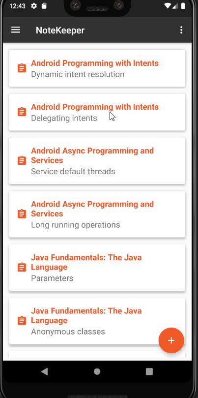

## Android Apps with Kotlin: Custom Views - PluralSight course

### Creating a custom view from scratch

 - create a custom view ColorDialView by extending the View class
 - onDraw, onMeasure
 - position and custom sizing with attributes
 - make the view flexible and interactive with motion events

## Screenshots

